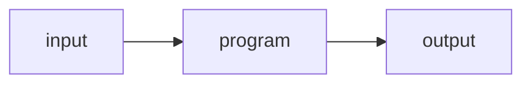
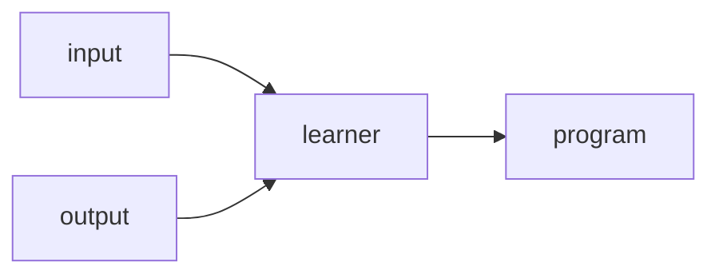
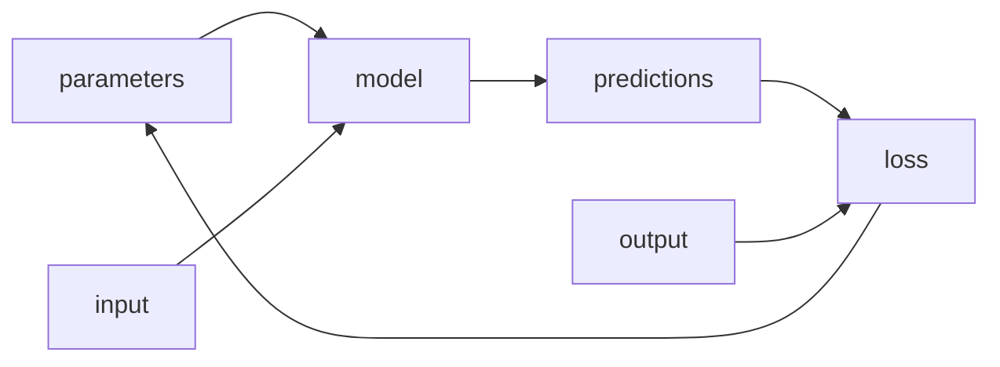

# La Rivoluzione del Machine Learning

Questo il sommario:

1. TOC
{:toc}

## Le Origini del Machine Learning

Nel 1949, un ricercatore dell'IBM, Arthur Samuel, immaginò e definì un modo per far eseguire ai computer dei compiti, alternativo rispetto alla programmazione tradizionale. In un articolo del 1962, divenuto un classico ("Artificial Intelligence: A Frontier of Automation") [^1] lo stesso autore descrive come la costruzione di programmi atti a risolvere alcuni problemi, come il riconoscimento di oggetti, risulti estremamente difficile, se non impossibile, per il fatto che occorre fornire al computer tutti i singoli passaggi del processo fino al dettaglio più minimo ("every minute step of the process in the most exasperating detail"). I computer infatti, aggiunge, "as any programmer will tell you, are giant morons, not giant brains".
E' interessante notare come Samuel, già a quei tempi, ponendosi l'obiettivo di identificare la vera natura della cosiddetta "intelligenza artificiale" che cominciava a far parlare di sè il mondo accademico e la società, nell'articolo citato e in un articolo precedente del 1961, in antitesi a Norbert Wiener, che riteneva piuttosto l'automazione una potenziale minaccia per l'umanità, giungeva ad una conclusione senz'altro più ottimistica. 
Samuel notava che macchine più intelligenti avrebbero liberato l'uomo dallo svolgimento dei compiti più banali e che alla fine tra i vantaggi ottenuti e lo "scossone" sociale ed economico introdotto dal cambiamento tecnologico, il bilancio sarebbe stato a favore dei primi. Analizzeremo questi aspetti in un prossimo post.

La "magia" del computer risiede infatti non tanto in quello che fa, ma nella *velocità* e *accuratezza* con cui lo fa, eseguendo una sequenza di piccoli passi computazionali, per mezzo dei quali è in grado di portare a termine il compito assegnato.
Questa sequenza tuttavia, è bene ricordarlo, deve essere sempre prima specificata da un programmatore umano, il quale deve fare lo sforzo cognitivo di identificare in anticipo tutti i passi necessari alla soluzione del problema (l'*algoritmo*) e tradurli in un insieme di istruzioni in un qualche linguaggio eseguibile dalla macchina (il *programma*), affinchè questa sia in grado di fornire, al termine della computazione, la soluzione cercata a partire dai dati di ingresso.
Si può caratterizzare in questo caso il risultato che il computer produce come derivato interamente dai dati di *input* a cui vengono applicate una serie di *regole ben definite* che trasformano questi dati in altri dati organizzati in modo differente, denominati *output*, secondo l'obiettivo desiderato dal programmatore.

Dice in sostanza Samuel che in questo uso "ordinario" del computer occorre necessariamente specificare alla macchina il "come", ovvero il modo esatto con cui si ottiene il risultato (la serie precisa di passi), senza potersi limitare al "cosa" si vuole ottenere, come si farebbe assegnando lo stesso compito ad un essere umano. In altre parole, è utile usare il computer perchè si tratta di una macchina estremamente efficiente e precisa, ma essenzialmente stupida, e quindi l'uomo deve prima "istruirla", programmandola in modo esplicito. La cosa essenziale da notare qui è che non ci sono sconti nel lavoro del pensiero che l'uomo è costretto a fare per risolvere un problema, ma solo (e non è poco) vantaggi nel giungere al risultato in modo più preciso, veloce e affidabile.
Nel definire questo uso del computer "comune" o "ordinario" Samuel non vuole certo sottovalutare l'enorme impatto economico e sociale dell'automazione, che non esita a definire una "rivoluzione", ma piuttosto ridurla ai suoi termini essenziali, sottolineando come essa sia frutto dell'applicazione diretta di elementari procedure di calcolo a problemi che, per loro natura, sono di "routine" ovvero riconducibili a processi descrivibili mediante un insieme di regole esplicite.

Tuttavia esistono moltissimi esempi di problemi e processi che non sono "addomesticabili" ad una logica strettamente procedurale. Ad esempio nel gioco della dama o degli scacchi, non appare semplice identificare una strategia o procedura che garantisca la vittoria contro un avversario intelligente, al di là della ovvia applicazione delle regole del gioco.

In altre parole, in certi casi è molto difficile risolvere il problema mediante l'uso di un algoritmo, ovvero una sequenza completamente definita di passi che garantisce di fornire la soluzione purchè si abbia la pazienza e il tempo di seguirlo fino in fondo. Questo può non accadere o perchè il tempo per arrivare alla soluzione è troppo lungo o perchè non si riesce a descrivere i singoli passi in modo preciso come sarebbe necessario perchè un computer possa eseguirli.
Ad esempio, non è chiaro come si debba programmare un robot per farlo camminare o fargli muovere un braccio per afferrare un oggetto. O nel caso del riconoscimento di un immagine, come si possa descrivere una forma non banale come la scrittura di cifre e lettere che possono presentarsi in modo leggermente diverso ogni volta a seconda della calligrafia di chi scrive, oppure come si possa descrivere la differenza fra un cane e un gatto, considerando le variazioni individuali di baffi, coda, muso, corporatura, colore e come queste possano ulteriormente variare in base alla razza, all'età, alla posizione, all'inquadratura dell'immagine e innumerevoli altre variabili.

In questi casi si può procedere alla ricerca di procedure approssimate, in cui si cerca di analizzare la natura fondamentale del problema (es. le caratteristiche essenziali di un oggetto nel riconoscimento di immagini) per trovare una soluzione di tipo "euristico" [^2] che metta in campo delle strategie incomplete ma di buon senso, che consentano per tentativi ed errori di approssimare una soluzione soddisfacente.
Samuel paragona questo modo di procedere allo studio delle leggi dell'aerodinamica (la natura del problema) per costruire una macchina volante, in contrasto all'approccio opposto, che è quello di osservare gli uccelli in volo per replicarne il comportamento.

---

Il cambio di *paradigma* di Samuel, che dette origine alla rivoluzione del "machine learning" (termine reso popolare dallo stesso Samuel) consistette nel ribaltare completamente l'approccio alla programmazione tradizionale, perchè invece di comunicare al computer i passi precisi richiesti per la soluzione del problema, Samuel ebbe piuttosto l'idea di *mostrare al computer "esempi" del problema da risolvere* e lasciare che il computer (opportunamente programmato in modo tradizionale) "imparasse" a risolverlo. Questa idea si rivelò rivoluzionaria, tanto che nel 1961 il suo programma per giocare a dama sconfisse il campione dello stato del Connecticut dell'epoca.
Samuel getta così i semi del Machine Learning (che comprende il Deep Learning) la cui pianta è cresciuta fino ad oggi, portando sviluppi poderosi e frutti che da qualche anno si stanno affermando nei campi più diversi. 
Nello stesso articolo sopra menzionato del 1962, nelle sue parole si possono individuare i concetti essenziali dell'apprendimento automatico.

> Suppose we arrange for some **automatic means of testing** the effectiveness of any **current weight assignment** in terms of **actual performance** and provide a **mechanism for altering the weight assignment** so as to **maximize the performance**. We need not go into the details of such a procedure to see that it could be made entirely automatic and to see that a **machine** so programmed would **learn from its experience**.

Abbiamo, in questa citazione, tutti gli elementi fondanti del machine learning: [^3] in primo luogo un programma (o per usare una terminologia più moderna un "modello") che incorpora dei parametri, cioè delle variabili a cui può essere assegnato un valore ("weight assignment"), che determinano il comportamento del programma stesso; in secondo luogo un modo automatico con cui misurare l'efficacia di questi parametri in termini di prestazioni del modello rispetto ad un obiettivo dato e infine un meccanismo (quindi un altro procedimento automatico) con cui aggiustare questi parametri in modo da massimizzare tali prestazioni.
Se disponiamo di questi elementi possiamo dunque costruire un sistema che, acquisendo dei dati di input, sia in grado, rispetto a una metrica definita, di ottimizzare le sue prestazioni variando i suoi parametri interni, fino ad ottenere il risultato desiderato. Così facendo, abbiamo, di fatto, costruito una macchina in grado di "imparare dall'esperienza". 
L'addestramento di modelli sviluppati secondo la modalità sopra esposta è ciò che viene definito "machine learning".
E' interessante notare che il risultato di questa procedura, cioè il modello finale che incorpora i valori ottimi dei parametri, può considerarsi a tutti gli effetti un altro tipo di programma per computer, ottenuto attraverso un processo di apprendimento, ma essenzialmente sempre un programma, che a partire da un *input* dato andrà a generare il suo *output*.

Steps Toward Artificial Intelligence - Marvin Minsky [^4]

## Note

[^1]: [The Annals of the American Academy of Political and Social Science, Vol. 340, Automation (Mar., 1962), pp. 10-20 (11 pages)](https://www.jstor.org/stable/1033694)

[^2]: from [wikipedia](https://en.wikipedia.org/wiki/Heuristic): A heuristic (/hjʊˈrɪstɪk/; from Ancient Greek εὑρίσκω (heurískō) 'to find, discover'), or heuristic technique, is any approach to problem solving or self-discovery that employs a practical method that is not guaranteed to be optimal, perfect, or rational, but is nevertheless sufficient for reaching an immediate, short-term goal or approximation. Where finding an optimal solution is impossible or impractical, heuristic methods can be used to speed up the process of finding a satisfactory solution. Heuristics can be mental shortcuts that ease the cognitive load of making a decision.Examples that employ heuristics include using trial and error, a rule of thumb or an educated guess.

[^3]: [Practical Deep Learning - Course at fast.ai - Chapter 1](https://github.com/fastai/fastbook/blob/master/01_intro.ipynb)

[^4]: [Steps Toward Artificial Intelligence - article by Marvin Minsky](https://web.media.mit.edu/~minsky/papers/steps.html)

